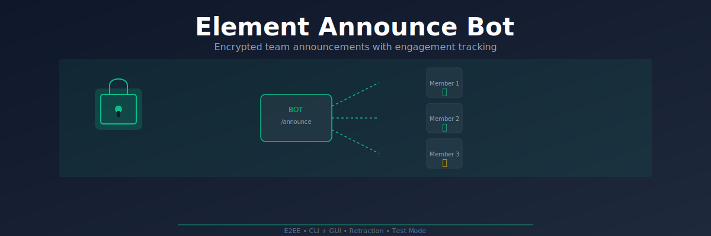

<p align="center">
  
</p>

# Element Announce Bot

**Send encrypted team announcements and track who read them.**

A Matrix/Element bot that DMs each team member individually, tracks ✅ reactions as read confirmations, and gives the admin a desktop GUI to manage it all. End-to-end encrypted, no third-party servers.

---

## Quick Look

| What | How |
|------|-----|
| Send announcement | `/announce <message>` or GUI "Send to All" |
| Track engagement | React ✅ in DM — admin sees live status |
| Retract message | `/retract <id>` or GUI "Retract" button |
| Test before broadcast | Select recipients in GUI, or `/settest` + `/announce` |
| Manage members | `/register <name>`, `/members`, or GUI Members tab |
| Save templates | GUI Templates panel — save, load, delete |

---

## What It Is

A Python bot that runs on your Matrix homeserver. When the admin sends an announcement, the bot DMs every registered team member in their own encrypted room. Each member confirms by reacting with ✅. The admin monitors completion from the GUI or via `/status`.

Built on [matrix-nio](https://github.com/matrix-nio/matrix-nio) with E2EE support via `libolm`. The GUI uses [CustomTkinter](https://github.com/TomSchimansky/CustomTkinter).

---

## Why It Is Different

| Feature | Element Announce Bot | Typical bots |
|---------|---------------------|--------------|
| **E2EE** | All messages encrypted (Megolm via libolm) | Plaintext or relies on server-side encryption |
| **DM delivery** | Each member gets a private DM — not a shared room | Announcements in a group chat where people scroll past |
| **Dual interface** | CLI bot commands + desktop GUI admin panel | CLI only, or web dashboard that needs hosting |
| **Retraction** | Admin can redact (delete) any announcement | Messages stay forever |
| **Test mode** | Send to selected members before broadcasting | All-or-nothing |
| **Templates** | Save and reuse announcement templates (GUI) | Copy-paste |
| **Confirmation flow** | `/announce` drafts → `/confirm` to broadcast | Instant send, no review |

---

## How It Works

```
Admin (GUI or CLI)
        │
        ├── /announce "message" → draft created
        │       └── /confirm → broadcast
        │
        └── GUI "Send to All" → preview → confirm → broadcast
                │
                ▼
    ┌──────────────────────┐
    │   Bot sends DM to    │
    │   each registered    │
    │   member (E2EE)      │
    └──────────────────────┘
                │
                ▼
    ┌──────────────────────┐
    │   Member reacts ✅   │
    │   in their DM        │
    └──────────────────────┘
                │
                ▼
    ┌──────────────────────┐
    │   Bot tracks who     │
    │   confirmed          │
    │   Admin checks       │
    │   /status or GUI     │
    └──────────────────────┘
```

Announcements are sent to individual DM rooms (not a shared channel). The bot verifies each room is a true 2-member DM before sending — group rooms are skipped with a warning.

---

## Setup

### 1. Create a Matrix bot account

- Register a new account on your Matrix homeserver
- Note the `@user:homeserver.org` User ID
- Get the Room ID of your team room (Room Settings → Advanced → Room ID)

### 2. Configure environment

```bash
cp .env.example .env
```

Edit `.env`:

```
HOMESERVER=https://matrix.yourserver.org
USER_ID=@yourbot:yourserver.org
PASSWORD=your-bot-password
ADMIN_ID=@admin:yourserver.org
ROOM_ID=!roomid:yourserver.org
```

For SSO/Google login, set `ACCESS_TOKEN` instead of `PASSWORD`:

```
ACCESS_TOKEN=syt_your_token_here
```

### 3. Install dependencies

```bash
# macOS (required for E2EE)
brew install libolm

python3 -m venv venv
source venv/bin/activate
pip install -r requirements.txt
```

### 4. Run

```bash
# Bot (listens for commands, tracks reactions)
python3 bot.py

# Admin GUI (desktop app)
python3 admin_gui.py
```

Or double-click `launch.command` on macOS.

---

## Bot Commands

| Command | Description |
|---------|-------------|
| `/register <name>` | Register as a team member |
| `/announce <text>` | Draft an announcement (admin) |
| `/confirm` | Broadcast the pending draft (admin) |
| `/cancel` | Discard the pending draft (admin) |
| `/status` | Show latest announcement completion (admin) |
| `/retract <id>` | Redact an announcement (admin) |
| `/members` | List all registered members (admin) |
| `/settest <user_id>` | Add a test recipient (admin) |
| `/testlist` | List test recipients (admin) |
| `/help` | Show available commands |

---

## GUI Features

The desktop admin panel (`admin_gui.py`) provides:

- **Announce tab** — Compose, preview, send to all or selected members
- **Status tab** — Live engagement progress with completion bar
- **Members tab** — Add/remove team members
- **Test Users tab** — Manage test recipients
- **Settings tab** — View configuration and data file paths
- **Templates** — Save, load, and delete announcement templates
- **Activity log** — Real-time send status for each member

---

## Data Files

| File | Purpose |
|------|---------|
| `config.json` | Team member list and test user IDs |
| `data.json` | Announcement history with completion tracking |
| `templates.json` | Saved announcement templates (GUI) |
| `credentials.json` | Bot login session (auto-created) |
| `store/` | Matrix E2EE state (auto-created, do not delete) |
| `bot.log` | Bot activity log |

---

## Requirements

- Python 3.10+
- `libolm` (for E2EE support)
- A Matrix homeserver account
- Element 1.12.22 or compatible client

---

## License

MIT
